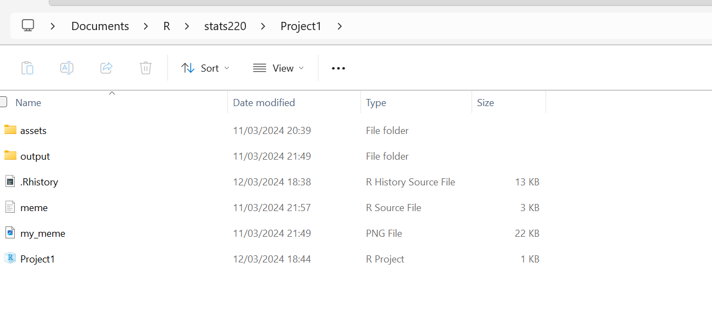
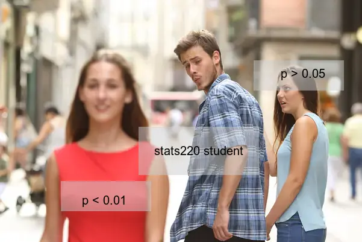

```{r setup, include=FALSE}
knitr::opts_chunk$set(echo=TRUE, message=FALSE, warning=FALSE, error=FALSE)
```

```{css}
@import url('https://fonts.googleapis.com/css2?family=Roboto:wght@400;700&display=swap');

body {
  font-family: 'Roboto', sans-serif;
  display: flex;
  flex-direction: column;
  align-items: center;
  justify-content: center;
  font-size: 16px;
  background-color: #f0f0f0; 
  color: #333333;
  min-height: 100vh;
  text-align: center;
}

.subtitle {
  font-size: 25px;
  color: #2a7ae2;
  margin: 10px auto; 
  text-align: center;
}

.author {
  font-size: 20px;
  color: #2a7ae2;
  margin: 10px auto;
  text-align: center;
}

h1, h2 {
  text-align: center;
}

h1 {
  font-size: 36px;
  font-weight: 700;
  color: #2a7ae2;
  margin-bottom: 20px;
}

h2 {
  font-size: 28px;
  font-weight: 700;
  color: #2a9d8f;
  margin-bottom: 15px;
}

table, figure, img {
  margin-left: auto;
  margin-right: auto;
  text-align: center;
}
```

## Project requirements
In terms of the project requirements, I feel I have met them all. I shall go through them part by part:
  - Part A **Setting up a GitHub account and repo**:
    - I created the repository and commited a read me file in markdown covering all the syntax's required in markdown and you can view this [here](https://github.com/Odhran7/stats220). The repo is also public so you should be able to view!!
  - Part B **Meme Creation**:
    - I created the necessary file structure  and project in Rstudio. I scoured the web looking for inspo which I found [here](https://media.wired.com/photos/59a459d3b345f64511c5e3d4/master/pass/MemeLoveTriangle_297886754.jpg). I then used my witty humour and R programming skills to annotate this and turn it into an actual meme. I programmed in a very user-friendly way so that anyone who comes to read it can easily follow the logic and edit it in any way they see please. I also ensured to use all the required R logic and magick library functions as outlined below:
  - Part C **HTML Creation**:
    - I feel I 
  
## My meme

```{r meme-code, eval=TRUE}
# This is the R script used to create a new meme

# Import dependencies 
# install.packages("magick")
library(magick)

# Read and display the inspiration meme
inspo_meme <- image_read("./assets/inspo_meme.jpg")
print(inspo_meme)

# Let's create the new meme
# The plan here is to adapt the existing meme to be have a funny twist surrounding the concept of statistical significance
# Convert .webp to png
backgroundWebP <- image_read("./assets/backgroundWebp.webp")
background_resized <- image_resize(backgroundWebP, "601x401")
backgroundPng <- image_write(background_resized, "./output/background.png") # Same wxh dimensions as our inspo
background <- image_read("./output/background.png")

# We can view the template we are working with here
print(background)

# Now that we have the basic image let's add some text
# Here are all the properties we will be using to simplify things:
text_properties <- list(
  text = c("p > 0.05", "stats220 student", "p < 0.01"),
  size = c(20, 20, 20),
  color = "black",
  location = c("+60+110", "+30+50", "+390+320"),
  gravity = c("northeast", "center", "northeast")
)

old_girlfriend_box <- image_blank(width=150, height=50, color="#CCCCCC80")
main_character_box <- image_blank(width=200, height=80, color="#CCCCCC80")
new_girlfriend_box <- image_blank(width=150, height=50, color="#CCCCCC80")


background_final <- background %>%
  # Old Girlfriend part
  image_composite(old_girlfriend_box, offset="+30+100", gravity="northeast") %>%
  image_annotate(text=text_properties$text[1], size=text_properties$size[1], color=text_properties$color, location=text_properties$location[1], gravity=text_properties$gravity[1]) %>%
  # Main Character
  image_composite(main_character_box, offset="+30+50", gravity="center") %>%
  image_annotate(text=text_properties$text[2], size=text_properties$size[2], color=text_properties$color, location=text_properties$location[2], gravity=text_properties$gravity[2]) %>%
  # New Girlfriend
  image_composite(new_girlfriend_box, offset="+350+300", gravity="northeast") %>%
  image_annotate(text=text_properties$text[3], size=text_properties$size[3], color=text_properties$color, location=text_properties$location[3], gravity=text_properties$gravity[3])

# And the final product
print(background_final)

# We need to use the image.append function so we will do a side by side comparison
meme_comparison <- c(background_final, background_resized) %>%
  image_append(stack = TRUE)

# We can see what we started with and what we ended up with below:
print(meme_comparison)


# Saving the meme
#background_final %>% image_write("./output/my_meme.png")
# Uncomment the above if you want to re-save it!

```
Take a look at my meme 

```{r animation-code, eval=FALSE}

# Let us animate the meme now

# I found some frames online 
frame1 <- image_read("./assets/gif1.png")
frame1_resized <- image_resize(frame1, "601x401")
frame2 <- image_read("./assets/gif2.jpeg")
frame2_resized <- image_resize(frame2, "601x401")

# Add caption one
caption <- "Hmm, should I switch to p < 0.01?"
background_with_thought <- background %>%
  image_annotate(caption, size = 20, color = 'blue', location = 'north')

# Add frame annotated and aurora effect
frame1_highlighted <- frame1_resized %>%
  image_modulate(brightness = 150, saturation = 120) %>%
  image_annotate("STATISTICAL SIGNIFICANCE", size = 20, color = 'green', location = 'south')

# The reality....
frame2_fail <- frame2_resized %>%
  image_annotate("You can't do maths", size = 20, color = 'red', location = 'center')
animation_frames <- c(background_final, background_with_thought, frame1_highlighted, frame2_fail)
animation <- image_animate(animation_frames, fps = 0.5)

# Save the GIF to the ouptut folder
#image_write(animation, "./output/my_animation.gif")
# Uncomment the above if you want to re-save it!

```

## Creativity
My project demonstrates creativity for a number of reasons:
1. I have adapted a well-known meme to the realm of statistics (not an easy thing to do!).
2. From a technical perspective, I used other variants of the meme to produce the GIF and I also streamlined the variable creation (text, size, gravities etc.) through the use of a vector to enable someone else to have their own spin on it (What's more creative than giving someone else a space to be creative!)
3. For the output, I used UI/UX friendly fonts along with using a color palette generator to make the html come across as easy and accessible as possible.
4. I used additional functions to resize the images in order to make the meme/gif look as polished as possible along with adding multiple different levels of saturation and brightness to add as much emphasis to the gif as possible

## Learning reflection
I feel like I am more competent in the use of *Creating HTML by combining Modern Technologies* and I have a few reflections to make on the learnings from this module:
1. I really noticed the impact of the presentation of the use of the data technologies. For example, the markdown file makes it really accessible to *all* audiences to visualise the results of data science and it will stand with me on future projects as the complexity grows
2. I also (after multiple iterations) realised the importance of writing neat and tidy code and having a clean and semantic working directory. Everytime I ran the code it outputted to the working directory which overwrote the meme and made it confusing - so making input (in my case assets folder) and output folders really made things easier to work with. The neat and tidy code came in helpful at the end when I wanted to modify the existing meme to be slightly different which was a breeze since the code was well structured, commented and modular.
